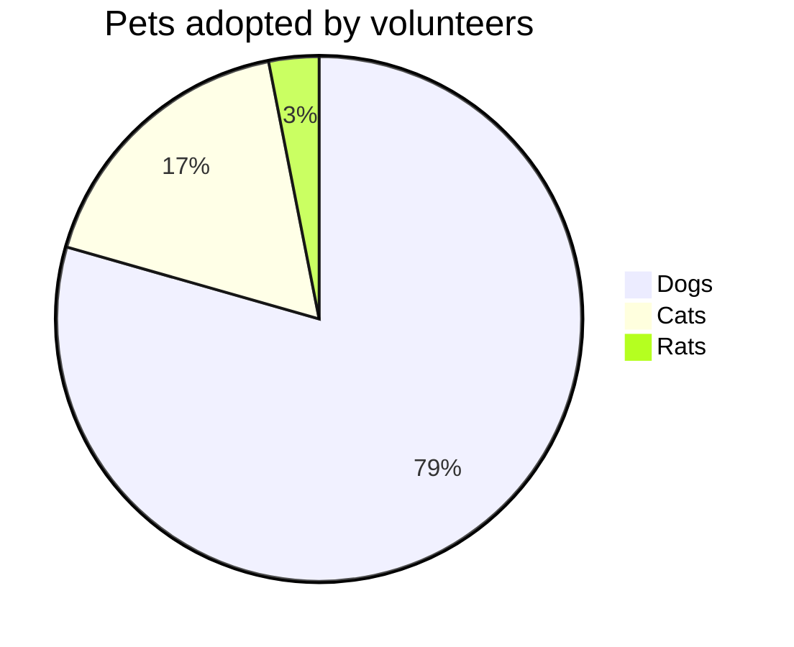

**Mermaid lets you create diagrams and visualizations using text and code.**

It is a JavaScript based diagramming and charting tool that renders Markdown-inspired text definitions to create and modify diagrams dynamically.

It's integrated into Obsidian and can work as a great tool to create quick and easy diagrams.
The Syntax to create a diagram inside obsidian is by using triple backticks and noting 
`mermaid` as the language

\`\`\` mermaid
\[Here goes the mermaid code\]
\`\`\`

## Examples

### Pie Chart

